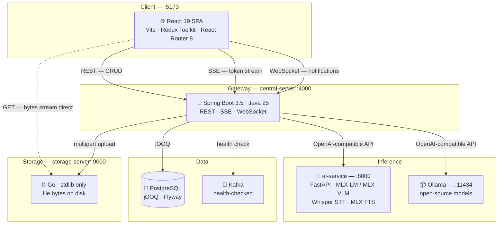
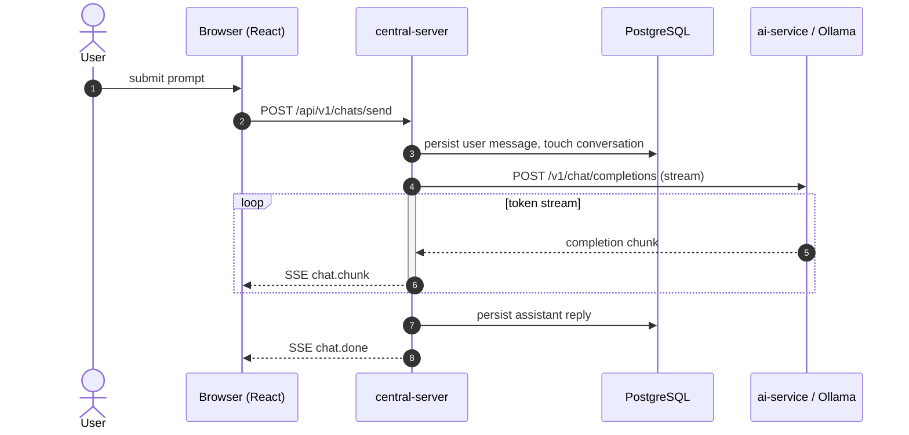

# Pro Professor

[](LICENSE)


**A fully local, multimodal AI workspace.** Chat, Obsidian-style notes, and a diagram
editor — text, voice, and file-attachment conversations with open-source LLMs running entirely on
your own machine, no cloud provider, no API keys, no data leaving the device.

Pro Professor is a polyglot monorepo: a React 19 SPA, a Spring Boot (Java 25) orchestration
gateway, and a Python/FastAPI inference service running MLX models on Apple Silicon, backed by
PostgreSQL and a standalone Go file-storage server. The browser talks to exactly one backend;
the gateway fans out to everything else.

---

## Contents

- [Why it exists](#why-it-exists)
- [What you can do with it](#what-you-can-do-with-it)
- [Engineering Highlights](#engineering-highlights)
- [Tech Stack](#tech-stack)
- [System Design](#system-design)
- [Repository Layout](#repository-layout)
- [Documentation Map](#documentation-map)
- [Getting Started](#getting-started)
- [Everyday Tasks](#everyday-tasks)

---

## Why it exists

Most AI workspaces are thin clients over someone else's inference. This one owns the whole path:
the model weights, the transcription, the speech synthesis, the database, and the file bytes all
sit on the same machine as the browser tab. That constraint drives the design — a single gateway
the browser trusts, an OpenAI-compatible client so any local engine can be swapped in by changing
a base URL, and storage that never round-trips file bytes through the JVM.

---

## What you can do with it

### 💬 Chat

Hold streaming conversations with local models. Responses arrive token-by-token over SSE, along
with the model's live reasoning ("thinking") and per-response metrics — tokens/sec, context usage,
time to first token. Conversations are organised in a sidebar, renamed, deleted, and reopened with
their full transcript and settings intact. Markdown, GFM tables, syntax highlighting, and KaTeX
math all render inline.

### 🎙️ Voice

Push-to-talk capture with a live mic-reactive waveform. Speech is transcribed locally (Whisper /
MLX), and replies are spoken back through local TTS — no network round-trips. For audio-capable
models the raw clip is passed straight to the model as an OpenAI `input_audio` content part,
skipping transcription entirely.

### 📎 Attachments

Drop in images, audio, or documents. Uploads stream through the gateway to the Go storage server,
which returns a direct URL; PostgreSQL keeps only a reference row. Downloads then stream straight
from storage to the browser — file bytes never pass through the JVM heap.

### 📝 Notes

An Obsidian-style Markdown workspace: `[[wiki-links]]`, `![[embeds]]`, backlinks, tags, frontmatter,
full-text search (Postgres `tsvector` + GIN), a Mermaid-rendered graph view, revision history, a
slash menu, and a command palette. AI actions — **Rewrite**, **Summarize**, **Continue** — stream
into the editor over the same SSE pipeline as chat, and a side panel lets you chat about the note
you're looking at.

### 🖇️ Diagrams

A hand-drawn diagram workspace built on [Excalidraw](https://github.com/excalidraw/excalidraw),
tuned to a clean, professional (non-sketchy) default style. Diagrams live in folders, autosave with
debouncing, and are stored inline in Postgres like notes. Notes reference a standalone diagram via
`[[Title.diagram]]`, or draw inline diagrams with Mermaid.

### ⚙️ Models & settings

Discover installed Ollama and MLX models from one place, pick the active one, and tune sampling
parameters. Inference settings are persisted **per conversation**, restored on reopen, and
mid-conversation changes are diffed and rendered as inline markers in the transcript.

---

## Engineering Highlights

- **Token-by-token streaming** over Server-Sent Events, including live model reasoning
  ("thinking") and per-response performance metrics.
- **Two inference backends, one interface** — Ollama (open-source models) and a local MLX
  service are both driven through a single OpenAI-compatible client; the gateway swaps only the
  base URL, so adding a provider is configuration, not code.
- **Native multimodal input** — audio-capable models receive the raw clip directly rather than a
  transcript.
- **Bytes never touch the JVM** — the gateway records a storage reference and hands the browser a
  direct storage-server URL; uploads and downloads stream straight to the Go storage server.
- **Production-minded gateway** — request-ID correlation across logs (MDC), clean mid-stream
  abort handling, actuator + Kafka health checks, Flyway migrations, and compile-time-safe SQL
  via jOOQ.
- **Route-loader data fetching** — every page's on-arrival data is fetched by a React Router
  loader before the screen renders, not by a `useEffect` after mount.
- **Lean dependency budget** — the storage server is Go stdlib only, zero dependencies; heavy
  frontend libraries (Excalidraw, Mermaid) are lazy-loaded out of the main bundle.
- **Real-time channels chosen per use case** — SSE for token streaming (cancellable,
  reconnect-friendly), a WebSocket for lightweight server→client notifications, plain REST for
  everything else.

---

## Tech Stack

| Layer     | Technologies                                                                                                                                                                 |
| --------- | ---------------------------------------------------------------------------------------------------------------------------------------------------------------------------- |
| Frontend  | React 19 (+ React Compiler), TypeScript, Vite, Redux Toolkit, React Router 8, Tailwind 4, Radix / shadcn, Excalidraw, Mermaid, react-markdown + remark/rehype, KaTeX, Vitest |
| Gateway   | Java 25, Spring Boot 3.5, jOOQ, Flyway, OpenAI Java SDK, SSE, WebSocket, Actuator                                                                                            |
| Inference | Python, FastAPI, MLX-LM / MLX-VLM, Whisper (STT), MLX TTS                                                                                                                    |
| Storage   | Go 1.25 (standard library only, zero dependencies)                                                                                                                           |
| Data      | PostgreSQL                                                                                                                                                                   |
| Tooling   | Maven, npm, Taskfile, ESLint, Prettier, OWASP Dependency-Check                                                                                                               |

---

## System Design



The browser talks to **one** backend. Every request goes through the gateway, which fans out to
inference, storage, and Postgres. The one exception is media **downloads**: the gateway hands back
a direct storage-server URL and file bytes stream straight to the browser, never through the JVM.

| Service          | Stack                                  | Default URL              | Role                                                    |
| ---------------- | -------------------------------------- | ------------------------ | ------------------------------------------------------- |
| `frontend`       | React 19, Vite, TS, Tailwind 4, Redux  | `http://localhost:5173`  | Web client — chat, notes, diagrams UI                   |
| `central-server` | Spring Boot 3.5, Java 25, jOOQ, Flyway | `http://localhost:4000`  | API gateway; REST + SSE + WebSocket, PostgreSQL         |
| `ai-service`     | Python, FastAPI, MLX-LM                | `http://localhost:8000`  | Local LLM inference + STT/TTS (Apple Silicon)           |
| `storage-server` | Go 1.25 (stdlib only)                  | `http://localhost:9000`  | Local file storage — uploads + direct browser downloads |
| `ollama`         | external inference engine              | `http://localhost:11434` | Open-source model serving                               |

The gateway exposes one versioned REST surface under `/api/v1`: `chats`, `notes`, `diagrams`,
`diagram-folders`, `media`, `audio`, `models`, `settings`.

**`ai-service`** is a git submodule maintained in its own repository. **`storage-server`** is a
first-class service committed in this repo under `backend/storage-server/`.

### Request Flow: Streaming Chat (SSE)

The core interaction — a chat send — is fully asynchronous end to end: the gateway opens a
long-lived SSE response and streams model tokens back as they're generated, persisting to Postgres
without blocking the stream.



If the client disconnects mid-stream (user hits Stop), the gateway detects it, aborts generation
cleanly, and skips the write — no orphaned completions.

---

## Repository Layout

```text
pro-professor/
├── frontend/                 # React 19 + Vite + TypeScript SPA
├── backend/
│   ├── central-server/       # Spring Boot 3.5 (Java 25) — API gateway / orchestrator
│   ├── ai-service/           # Python + FastAPI — local MLX inference (git submodule)
│   └── storage-server/       # Go 1.25 — local file storage (uploads + direct downloads)
├── docs/                     # system architecture + notes/diagram flow docs
├── skills/                   # paste-ready authoring packs for external AI models
├── scripts/                  # per-service setup scripts
├── Taskfile.yaml             # every dev command lives here
└── AGENTS.md                 # orientation pointer table for AI coding tools
```

---

## Documentation Map

Docs live **next to the tier they describe**; only cross-tier material sits in the root `docs/`.

| Scope       | Where                                                                           | What's in it                                                                  |
| ----------- | ------------------------------------------------------------------------------- | ----------------------------------------------------------------------------- |
| System-wide | [docs/project-flow.md](docs/project-flow.md)                                    | Architecture, request/stream flows, how the tiers interact — read this first  |
| System-wide | [docs/project-rules.md](docs/project-rules.md)                                  | Repository boundaries and cross-repo handoff workflow                         |
| Notes       | [docs/notes-flow.md](docs/notes-flow.md)                                        | Notes schema, link/embed resolution, search, AI action pipeline               |
| Diagrams    | [docs/diagram-flow.md](docs/diagram-flow.md)                                    | Excalidraw scene format, persistence, folders, note ↔ diagram linking         |
| Frontend    | [frontend/docs/folder-structure.md](frontend/docs/folder-structure.md)          | Module architecture and conventions                                           |
| Gateway     | [backend/central-server/docs/](backend/central-server/docs/folder-structure.md) | Package-by-feature layout, plus logging and database/migration rules          |
| Storage     | [backend/storage-server/docs/](backend/storage-server/docs/architecture.md)     | Architecture and HTTP API                                                     |
| AI tooling  | [AGENTS.md](AGENTS.md) · [skills/](skills/README.md)                            | Orientation for AI coding tools; prompt packs for authoring paste-ready notes |

Per-service READMEs:
[frontend](frontend/README.md) ·
[central-server](backend/central-server/README.md) ·
[ai-service](backend/ai-service/README.md) ·
[storage-server](backend/storage-server/README.md)

---

## Getting Started

**Prerequisites:** JDK 25, Node 20+, Python 3.11+, Go 1.25, PostgreSQL, Ollama, and an Apple
Silicon Mac (for MLX inference).

```bash
# 1. Clone with the ai-service submodule
git clone --recurse-submodules <repo-url>
cd pro-professor

# 2. Install dependencies + create each service's .env from its .env.example
task init

# 3. Adjust the generated .env files as needed (ports, DB, model paths, storage dir)
```

`task init` sets up the ai-service (submodule venv + dependencies) and installs the frontend and
central-server dependencies, creating each service's `.env` from its `.env.example` (existing
`.env` files are left untouched). The storage-server needs no fetch step — it is a single Go module
with zero external dependencies, so `task storage:run` builds it straight from source.

### Run (each in its own terminal)

```bash
task frontend:dev     # Vite dev server                  → http://localhost:5173
task backend:dev      # Spring Boot (needs Postgres)     → http://localhost:4000
task ai:run:api       # FastAPI inference (Apple Silicon) → http://localhost:8000
task storage:run      # Go storage server               → http://localhost:9000
```

---

## Everyday Tasks

All dev commands live in the root [Taskfile.yaml](Taskfile.yaml) — run `task -l` for the full list.

| Task                                 | Does                                    |
| ------------------------------------ | --------------------------------------- |
| `task backend:migrate`               | Apply Flyway migrations                 |
| `task backend:codegen`               | Regenerate jOOQ sources from the schema |
| `task storage:build`                 | Build the storage-server binary         |
| `task db:backup` / `task db:restore` | Dump / restore the Postgres database    |

Frontend checks run through npm from `frontend/`: `npm run lint`, `npm run test` (Vitest),
`npm run format`, `npm run build`.
